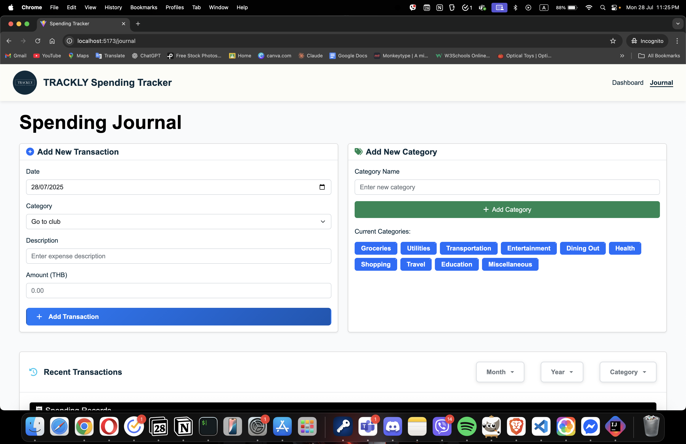

## Project 1 - Spending Tracker Web App
A simple React.js web application that helps users track their spending, visualize expenses with categories.
uses Bootstrap for UI design and Rechart for the charts

## Members
- Soe Min Min Latt - https://github.com/Tawan0224
- Min Thant - https://github.com/Minn01

📸 Screenshots
### Dashboard

### Journal

